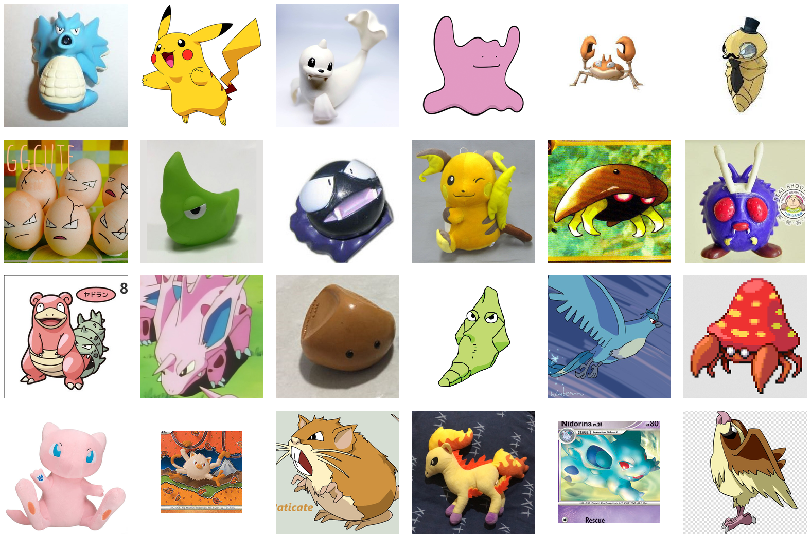

# FastGen: Fast Image Generation Challenge

**Mid Evaluation Submission Due:** October 31 (Saturday) 23:59 KST  
**Final Submission Due:** November 7 (Saturday) 23:59 KST  
**Where to Submit:** KLMS

## Overview



In this challenge, you will train two image generative models for the
first-generation Pokemon dataset: one optimized for exactly one model function
evaluation and one optimized for no more than four evaluations. The provided
code contains the dataset interface, model base class, checkpoint loading
utility, and FID evaluation pipeline. Students implement both NFE-specific
models and their `sample()` methods inside `model.py`.

**Dataset:** [Pokemon Generation One - 22k](https://www.kaggle.com/datasets/bhawks/pokemon-generation-one-22k)

**Dataset size:** 20,099 images from 151 Pokemon categories

**Evaluation:** FID scores from two independent model checkpoints:

- `ModelOneNFE`: exactly one model function evaluation
- `ModelFewNFE`: at most four model function evaluations

Each category is evaluated with exactly 20 generated images.


## Environment Setup

```shell
conda create -n pokemon-generation python=3.10 -y
conda activate pokemon-generation
pip install torch==2.6.0 torchvision==0.21.0 torchaudio==2.6.0 --index-url https://download.pytorch.org/whl/cu124
pip install -r requirements.txt
```

The supplied `requirements.txt` contains the packages needed by the dataset,
model, and evaluation code. Use the PyTorch installation appropriate for your
machine if a CUDA-specific build is required.

## Project Structure

```text
AIC313-Project-FastGen/
├── model.py                         # NFE-specific model classes (students SHOULD modify subclasses)
├── dataset.py                       # Pokemon dataset and DataLoader API (provided, DO NOT modify)
├── download_dataset.py              # Kaggle dataset download utility (provided, DO NOT modify)
├── evaluate.py                      # Sample generation and FID evaluation (provided, DO NOT modify)
├── src/
│   ├── __init__.py
│   └── utils.py                     # Parameter counting utilities (provided, DO NOT modify)
└── data/
    └── pokemon-generation-one-22k/
        ├── train_split.txt           # Fixed training split (provided, DO NOT modify)
        ├── val_split.txt             # Fixed validation split (provided, DO NOT modify)
        └── category_to_id.json       # Fixed category-to-ID mapping (provided, DO NOT modify)
```

## Dataset and DataLoader

Many source images are RGBA or palette images with transparency. At download
time, `download_dataset.py` composites every transparent image onto a white
background once, in place, and drops the alpha channel (a
`.transparency_composited_on_white` marker file records that this step already
ran). Training images, the FID reference set, and your generated samples
therefore all share the same opaque white-background convention.

The split manifests use the original paths from the Kaggle archive:

```text
PokemonData/Abra/000-063Abra_RB.png
PokemonData/Abra/Abra1.jpg
PokemonData/Pikachu/Pikachu1.jpg
```

The split contains:

```text
Train:      17,079 images
Validation:  3,020 images
Categories:    151
```

The dataset is downloaded automatically when `PokemonData/` is not present. You can also download it explicitly:

```shell
python download_dataset.py
```

The downloader uses `kagglehub` and stores the data under:

```text
./data/pokemon-generation-one-22k/PokemonData/
```

If Kaggle requests authentication, configure a Kaggle API token before running the command. Public datasets may be downloaded without authentication unless Kaggle requires user consent.

Create the data interface as follows:

```python
from dataset import PokemonDataModule

module = PokemonDataModule(
    data_root="./data/pokemon-generation-one-22k",
    split_dir="./data/pokemon-generation-one-22k",
    batch_size=32,
    return_category=True,
)

train_loader = module.train_dataloader()
val_loader = module.val_dataloader()
```

Images are converted to RGB, resized to `64 x 64`, converted to tensors, and normalized to `[-1, 1]`.

The category mapping is stored in `category_to_id.json` and reused on later
runs so that the same category always receives the same integer ID.

## What to Implement

### 1. Model

Students implement two independent model classes in `model.py`:

- `ModelOneNFE`: model and `sample()` implementation for exactly one model
  function evaluation
- `ModelFewNFE`: model and `sample()` implementation for no more than four
  model function evaluations

Each class may use a different architecture, objective, parameterization, and
sampling procedure. The `sample()` method belongs inside the corresponding
model class; no separate `sampling.py` module is required.

```python
class ModelOneNFE(Model):
    def sample(self, shape, *, device="cuda", category=None, **kwargs):
        ...


class ModelFewNFE(Model):
    def sample(self, shape, *, device="cuda", category=None, **kwargs):
        ...
```

`Model.load_checkpoint()` selects the model class from `evaluate_mode`:

```python
model = Model.load_checkpoint(
    checkpoint_path,
    evaluate_mode="one_nfe",
    device="cuda",
)
```

The selected model's `sample()` method is called directly during image
generation. Each model must return a tensor shaped like `shape`, normalized
consistently with the training data.

### 2. NFE budget

`ModelOneNFE.sample()` must use **exactly one** network evaluation and
`ModelFewNFE.sample()` **at most four**.

**Any execution of any part of the trained model backbone counts as one NFE.**
For example:

- a classifier-free-guidance pair (conditional plus unconditional forward pass)
  costs 2 NFEs per step, so a guided sampler fits at most two steps in the
  few-NFE budget
- a partial forward through a subset of the backbone blocks costs 1 NFE
- an extra head, decoder, or auxiliary network trained with the model costs
  1 NFE per execution

Operations that do not execute a trained network are free: noise sampling,
interpolation between tensors, noise schedules, and arithmetic on
intermediate results.

### 3. Parameter limit

Parameter counting is centralized in `src/utils.py`:

```python
from src.utils import count_parameters, parameter_summary
```

The evaluation script loads the selected model and counts all model parameters
before generating samples. Each submitted model is limited to
**100,000,000 parameters**, counted per model: `ModelOneNFE` and
`ModelFewNFE` each get their own 100M budget. Models above the limit are
rejected:

```text
WARNING: model has more than 100,000,000 parameters. Evaluation stopped.
```

This check includes frozen parameters, buffers excluded. It covers every
module registered on the model, so auxiliary networks (EMA copies, teacher
models, discriminators, encoders) count toward the same budget unless they are
dropped from the submitted checkpoint.

- ⚠️ Each model parameter size should not exceed 100M.
- ⚠️ A model that exceeds the limit is not evaluated and scores zero for that
  NFE mode; the other mode is scored independently.

## Training

Training is part of the student implementation. Students must train both
NFE-specific models and save two compatible checkpoints:

1. `./checkpoints/one_nfe.ckpt` for `evaluate_mode=one_nfe`
2. `./checkpoints/few_nfe.ckpt` for `evaluate_mode=few_nfe`

`Model.load_checkpoint()` selects the architecture from `evaluate_mode`, loads
the corresponding checkpoint, moves it to the requested device, and switches
it to evaluation mode.

The checkpoint can contain either a raw state dictionary or a dictionary with
the model state under the `state_dict` key:

```python
torch.save(
    {"state_dict": model_one_nfe.state_dict()},
    "checkpoints/one_nfe.ckpt",
)
torch.save(
    {"state_dict": model_few_nfe.state_dict()},
    "checkpoints/few_nfe.ckpt",
)
```

## Important Rules

**PLEASE READ THE FOLLOWING CAREFULLY!** Any violation of the rules or failure
to properly cite existing code, models, or papers used in the project in your
write-up will result in a zero score.

### What You CANNOT Do

- ❌ **Do NOT use pre-trained image-generation models:** You must train both
  submitted models from scratch.
- ❌ **Do NOT modify the base `Model` class:** Its checkpoint-loading and
  parameter-counting utilities are fixed for consistent evaluation.
- ❌ **Do NOT modify the provided dataset interface or evaluation script:**
  These files are provided to ensure consistent evaluation across submissions.
- ❌ **Do NOT modify the provided train/val split files:**
  `data/pokemon-generation-one-22k/train_split.txt` and
  `data/pokemon-generation-one-22k/val_split.txt` are fixed for consistent
  data splitting.
- ❌ **Do NOT train on the validation split:** Only the images listed in
  `train_split.txt` may be used for training, distillation, or hyper-parameter
  selection. The validation split is the FID reference set.
- ❌ **Do NOT exceed 20 GB of peak training VRAM:** Each model must train
  within a single 20 GB GPU, matching the NVIDIA A100 vGPU provided through
  KCLOUD for this course. Measure peak memory
  (`torch.cuda.max_memory_allocated()`) and keep it below the limit.
- ❌ **Do NOT install additional libraries separately:** Your code will run in
  the TA environment with the provided dependencies only. If a specific
  library is essential, request it through the course communication channel.

### What You CAN Do

- ✅ **Modify `model.py`:** Implement `ModelOneNFE`, `ModelFewNFE`, their
  model architectures, objectives, and `sample()` methods.
- ✅ **Add your own Training Script:** Add training logic, optimizers, learning-rate schedulers, model-specific arguments, and checkpoint-saving code.
- ✅ **Create new files:** Add any additional implementation files required by
your models or training procedure. Include every such file in the submission.
- ✅ **Use open-source implementations:** As long as they are clearly mentioned
and properly cited in your write-up.

## Evaluation

The performance of the two submitted model implementations will be evaluated
quantitatively using FID scores:

- `evaluate_mode=one_nfe`: evaluates `ModelOneNFE` with exactly one model
  function evaluation
- `evaluate_mode=few_nfe`: evaluates `ModelFewNFE` with no more than four
  model function evaluations

### Evaluation Procedure

The evaluation script selects the model and checkpoint from the two command
line arguments:

```shell
python evaluate.py \
    --model_checkpoint ./checkpoints/one_nfe.ckpt \
    --evaluate_mode one_nfe \
    --reference_dir ./results/reference \
    --output_dir ./results/evaluation
```

For the few-NFE model:

```shell
python evaluate.py \
    --model_checkpoint ./checkpoints/few_nfe.ckpt \
    --evaluate_mode few_nfe \
    --reference_dir ./results/reference \
    --output_dir ./results/evaluation
```

The evaluation script:

1. Instantiates `ModelOneNFE` or `ModelFewNFE` through
   `Model.load_checkpoint()`.
2. Counts all model parameters and stops if the total exceeds 100M.
3. Creates a balanced evaluation set with 20 samples for each of the 151
categories, producing 3,020 images for the selected model.
4. Calls the selected model's `sample()` method.
5. Computes FID against the complete validation reference set.

Output directories are selected by `evaluate_mode`:

```text
results/evaluation/
├── one_nfe/
│   ├── 0000_00.png
│   └── ...
└── few_nfe/
    ├── 0000_00.png
    └── ...
```

The reference set is created from `val_split.txt` and contains 3,020 images.
FID is calculated over the complete generated and reference directories.

- **TA reference scores:** 1-NFE: **39.15** · Few-NFE: **30.90**

## Submissions

### Mid-Term Evaluation (Optional)

The purpose of the mid-term evaluation is to give all students a reference point for how other teams are progressing. **Participation is optional.** At each NFE setting, the **top-1 team** whose score also outperforms the TAs’ FID score receives **bonus credit (+0.5)** toward the final grade. The TAs’ FID scores will be updated after the mid-term evaluation submission date.


**What to Submit:**

1. **Self-contained source code**
  - Include the complete code needed to train and evaluate both models.
  - The submitted code must run end-to-end in the TA evaluation environment.
2. **Model checkpoints**
  - Save `./checkpoints/one_nfe.ckpt`.
  - Save `./checkpoints/few_nfe.ckpt`.

**Submission Structure:**

```text
team_{team-id:0>2}/            # e.g. team_02
├── model.py                   # ModelOneNFE, ModelFewNFE, and Model
├── dataset.py                 # Provided dataset/DataLoader interface
├── download_dataset.py        # Provided dataset downloader
├── evaluate.py                # Provided evaluation entry point
├── src/
│   ├── __init__.py
│   └── utils.py               # Provided parameter-counting utilities
├── requirements.txt
├── checkpoints/
│   ├── one_nfe.ckpt      # REQUIRED
│   └── few_nfe.ckpt      # REQUIRED
└── <all additional files>     # Include every file you implemented
```

The `data/` directory and dataset files do not need to be submitted. TAs will
provide the dataset and fixed split files in the evaluation environment.
Include every additional file required to construct either model, train it, or
run evaluation.

**Evaluation:**

- TAs will evaluate both checkpoints with their corresponding
`evaluate_mode`.
- Each mode will generate 20 images for each of the 151 categories.
- Submissions that fail to load either checkpoint or run evaluation will be
marked as failed.

### Final Submission

**What to Submit:**

1. **Self-contained source code (Same as Mid-Term)**
2. **Model checkpoints (Same as Mid-Term)**
3. **Training implementation (Same as Mid-Term)**
4. **Write-up**

- Maximum **two A4 pages**, excluding references
- Must include **all** of the following:
  - **Technical details:** One-paragraph description of your few-step  
  generation implementation
  - **Training details:** Training logs, such as loss curves, and total  
  training time
  - **Qualitative evidence:** Approximately 8 sample images from early  
  training phases
  - **Citations:** All external code and papers used must be properly cited
- ⚠️ Missing any of these items will result in a **10% penalty for each**
- ⚠️ If the write-up exceeds two pages, any content beyond the second page  
will be ignored, which may lead to missing required items

**Submission Structure:**

```text
team_{team-id:0>2}/            # e.g. team_02
├── model.py                   # ModelOneNFE, ModelFewNFE, and Model
├── train.py                   # Student training script
├── dataset.py                 # Provided dataset/DataLoader interface
├── download_dataset.py        # Provided dataset downloader
├── evaluate.py                # Provided evaluation entry point
├── src/
│   ├── __init__.py
│   └── utils.py               # Provided parameter-counting utilities
├── requirements.txt
├── checkpoints/
│   ├── one_nfe.ckpt      # REQUIRED
│   └── few_nfe.ckpt      # REQUIRED
├── writeup.pdf                # Final submission write-up
└── <all additional files>     # Include every file you implemented
```

The `data/` directory and dataset files do not need to be submitted. TAs will
provide them in the evaluation environment. Include every additional file
required by the submitted implementation.

**Final Evaluation:**

- TAs will run `evaluate.py` once for each `evaluate_mode`.
- Results will be computed using the fixed validation split and official FID
procedure.
- Submissions that fail to load a checkpoint or run evaluation will be marked as failed.

## Self-Evaluation Checklist

Before submitting, verify:

- ✅ **Code runs end-to-end:** Train both models → Generate samples → Evaluate
both checkpoints without errors
- ✅ **Checkpoint compatibility:** `Model.load_checkpoint()` successfully loads
both `one_nfe.ckpt` and `few_nfe.ckpt`
- ✅ **NFE budgets tested:** `ModelOneNFE` uses exactly one model function
  evaluation and `ModelFewNFE` uses no more than four
- ✅ **All required files included:** Source code, both checkpoints, and the
final write-up are included
- ✅ **Citations ready:** All external code, papers, models, and datasets are
properly cited in the write-up

## Grading

- **Total:** up to **20 points** from the FastGen project — **10 points for
one-NFE** and **10 points for few-NFE**
- **Quantitative evaluation:** FID scores for the one-NFE and few-NFE models,
officially computed by the TAs. For each NFE setting, points are assigned
relative to the best score achieved in the class
- **Write-up:** Clear technical explanation and proper citations; each missing
required item costs a 10% penalty
- **Bonus points (mid-term evaluation):** top-1 team per NFE setting that beats
the TA baseline receives **+0.5**
- **Bonus points (final evaluation):** per NFE setting, **1st: +1.0** and
**2nd / 3rd: +0.5 each**
- ⚠️ Teams that receive final-evaluation bonus points **must present their work
in class on November 16 (Monday)**; without the presentation the bonus points
are not awarded

## Important

- ⚠️ There is no late day. Submit on time.
- ⚠️ Late submission: Zero score
- ⚠️ Missing any required item in the final submission (samples, code/model,
write-up): Zero score
- ⚠️ Missing items in the write-up: 10% penalty for each
- ⚠️ Citation is mandatory: Any violation of the rules or failure to properly
cite existing code, models, or papers used in the project will result in a
zero score

## Recommended Reading

- [Variational Autoencoders](https://arxiv.org/abs/1312.6114) — Kingma and Welling, ICLR 2014
- [NICE: Non-linear Independent Components Estimation](https://arxiv.org/abs/1410.8516) — Dinh et al., 2015
- [Generative Adversarial Nets](https://arxiv.org/abs/1406.2661) — Goodfellow et al., NeurIPS 2014
- [Denoising Diffusion Probabilistic Models](https://arxiv.org/abs/2006.11239) — Ho et al., NeurIPS 2020
- [Flow Matching for Generative Modeling](https://arxiv.org/abs/2210.02747) — Lipman et al., ICLR 2023
- [Consistency Models](https://arxiv.org/abs/2303.01469) — Song et al., ICML 2023
- [Flow Straight and Fast: Learning to Generate and Transfer Data with Rectified Flow](https://arxiv.org/abs/2209.03003) — Liu et al., ICLR 2023
- [Progressive Distillation for Fast Sampling of Diffusion Models](https://arxiv.org/abs/2202.00512) — Salimans and Ho, ICLR 2022
- [Learning to Discretize Denoising Diffusion ODEs](https://arxiv.org/abs/2405.15506) — Tong et al., ICLR 2025
- [BézierFlow: Learning Bézier Stochastic Interpolant Schedulers for Few-Step Generation](https://arxiv.org/abs/2512.13255) — Min et al., ICLR 2026
- [One-step Diffusion with Distribution Matching Distillation](https://arxiv.org/abs/2311.18828) — Yin et al., CVPR 2024

## Dataset Citation

- [Pokemon Generation One - 22k](https://www.kaggle.com/datasets/bhawks/pokemon-generation-one-22k)

